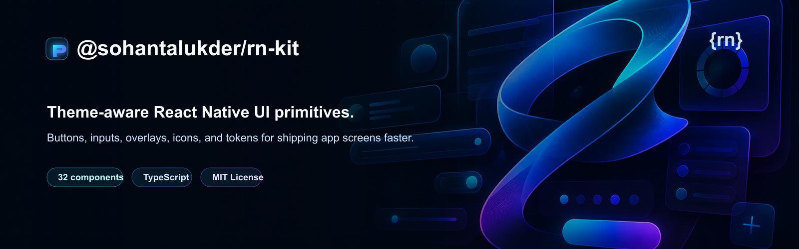

<p align="center">
  
</p>

<p align="center">
  <strong>Theme-aware React Native UI primitives for production app screens.</strong>
  <br />
  <a href="https://www.npmjs.com/package/@sohantalukder/rn-kit">npm package</a>
  ·
  <a href="https://github.com/sohantalukder/rn-kit">GitHub</a>
</p>

<p align="center">
  <a href="https://www.npmjs.com/package/@sohantalukder/rn-kit"></a>
  <a href="https://github.com/sohantalukder/rn-kit/actions/workflows/ci.yml"></a>
  <a href="https://www.npmjs.com/package/@sohantalukder/rn-kit"></a>
  <a href="./LICENSE"></a>
  
  
</p>

---

**@sohantalukder/rn-kit** is a React Native UI kit with theme-aware components, local SVG icons, overlay helpers, and TypeScript types.

Use it when you want a small design-system layer for app screens without copying button, input, modal, empty-state, and theme code between projects.

## Features

- Theme provider with default, dark, and system mode support
- 32 documented React Native components
- Buttons, inputs, selection controls, loaders, cards, modals, sheets, toasts, and screen wrappers
- Local SVG icon registry powered by `react-native-svg`
- Overlay helpers for toast, dialog, bottom sheet, and context menu flows
- CommonJS, ES module, and TypeScript declaration builds

## Install

```sh
npm install @sohantalukder/rn-kit
```

Install the required peer dependencies in your React Native app:

```sh
npm install \
  react-native-gesture-handler \
  react-native-reanimated \
  react-native-safe-area-context \
  react-native-svg
```

`Image`, `Avatar`, `PhotoCarousel`, `BottomSheet`, and the global bottom-sheet manager are implemented inside this package. They do not require FastImage or Gorhom Bottom Sheet.

Follow the native setup instructions for the peer packages you install, especially Reanimated, Gesture Handler, SVG, and Safe Area Context. React Navigation is not required by this package; if your app uses it, you can pass `theme.navigationTheme` to your navigation container.

## Quick Start

Wrap your app with `ThemeProvider`. Add `UiPortalProvider` if you use toast, dialog, bottom sheet, or context menu APIs. This example shows the root setup, a controlled field, validation, a submit handler, and toast feedback in one copyable screen.

```tsx
import { useState } from 'react';
import { View } from 'react-native';
import {
  Button,
  Card,
  Text,
  TextInput,
  ThemeProvider,
  UiPortalProvider,
  toast,
  useTheme,
} from '@sohantalukder/rn-kit';

function AccountScreen() {
  const [email, setEmail] = useState('');
  const [isSubmitting, setIsSubmitting] = useState(false);
  const { gutters, layout } = useTheme();

  const emailError =
    email.length > 0 && !email.includes('@')
      ? 'Enter a valid email address.'
      : undefined;

  const handleSubmit = () => {
    if (!email || emailError) {
      toast.show({ type: 'error', title: 'Add a valid email first' });
      return;
    }

    setIsSubmitting(true);
    toast.show({ type: 'success', title: 'Profile saved' });
    setTimeout(() => setIsSubmitting(false), 800);
  };

  return (
    <View style={[layout.flex_1, layout.justifyCenter, gutters.padding_24]}>
      <Card variant="outlined" style={gutters.gap_16}>
        <Text variant="heading3" weight="semibold">
          Account setup
        </Text>
        <Text color="secondary">
          Use controlled fields and let rn-kit handle theme-aware states.
        </Text>
        <TextInput
          label="Email"
          placeholder="you@example.com"
          keyboardType="email-address"
          autoCapitalize="none"
          value={email}
          errorMessage={emailError}
          onChangeText={(value) => setEmail(value)}
        />
        <Button
          text="Save profile"
          accessibilityLabel="Save profile"
          disabled={!email || Boolean(emailError)}
          isLoading={isSubmitting}
          onPress={handleSubmit}
        />
      </Card>
    </View>
  );
}

export default function App() {
  return (
    <ThemeProvider>
      <UiPortalProvider>
        <AccountScreen />
      </UiPortalProvider>
    </ThemeProvider>
  );
}
```

## Theme Persistence

You can keep the selected theme in your own storage layer:

```tsx
<ThemeProvider
  storageAdapter={{
    getTheme: () => localStore.getTheme(),
    setTheme: value => localStore.setTheme(value),
  }}
>
  {children}
</ThemeProvider>
```

Use `useTheme()` to read the active theme and switch between `default`, `dark`, and `system` modes:

```tsx
import { useTheme } from '@sohantalukder/rn-kit';

const {
  colors,
  backgrounds,
  borders,
  fonts,
  gutters,
  layout,
  navigationTheme,
  typographies,
  variant,
  changeTheme,
} = useTheme();

changeTheme('system');
```

Theme style groups include generated helpers for common screen composition:

```tsx
<View
  style={[
    layout.row,
    layout.itemsCenter,
    gutters.gap_12,
    gutters.padding_16,
    backgrounds.background,
    borders.rounded_16,
    borders.w_1,
    borders.gray8,
  ]}
>
  <Text style={[typographies.heading3, fonts.primary]}>Account</Text>
</View>
```

Custom brand or user colors can be passed directly to `ThemeProvider`, similar to provider APIs like React Native Paper.

```tsx
import { ThemeProvider } from '@sohantalukder/rn-kit';
import App from './src/App';

const theme = {
  colors: {
    primary: 'tomato',
    secondary: 'yellow',
    brand: '#2563EB',
  },
  variants: {
    dark: {
      colors: {
        primary: '#FF8A65',
        secondary: '#FDE047',
        brand: '#60A5FA',
      },
    },
  },
};

export default function Main() {
  return (
    <ThemeProvider theme={theme}>
      <App />
    </ThemeProvider>
  );
}
```

Color overrides cascade into raw colors and generated token groups:

```tsx
const { backgrounds, borders, colors, fonts } = useTheme();

colors.brand; // '#2563EB' or '#60A5FA' in dark mode
backgrounds.brand; // { backgroundColor: ... }
fonts.brand; // { color: ... }
borders.brand; // { borderColor: ... }
```

If you are changing the package defaults instead of a consuming app theme, edit `src/theme/_config.ts`.

## UI Providers

Mount `UiPortalProvider` once near the root when you use global overlay APIs:

```tsx
<ThemeProvider>
  <UiPortalProvider>{children}</UiPortalProvider>
</ThemeProvider>
```

Then call the exported managers from feature code:

```tsx
import { View } from 'react-native';
import {
  Button,
  Text,
  bottomSheet,
  contextMenu,
  dialog,
  toast,
  useTheme,
} from '@sohantalukder/rn-kit';

function FilterSheet({
  selectedStatus,
  onApply,
}: {
  selectedStatus: string;
  onApply: () => void;
}) {
  const { gutters } = useTheme();

  return (
    <View style={[gutters.gap_12, gutters.padding_16]}>
      <Text variant="heading3" weight="semibold">
        Filters
      </Text>
      <Text color="secondary">Current status: {selectedStatus}</Text>
      <Button
        text="Apply filters"
        onPress={() => {
          onApply();
          bottomSheet.close();
        }}
      />
    </View>
  );
}

export function ToolbarActions() {
  const { gutters } = useTheme();

  const saveProfile = () => {
    toast.show({ type: 'success', title: 'Profile saved' });
  };

  const deleteItem = () => {
    dialog.confirm('Delete item?', 'This action cannot be undone.', () => {
      toast.show({ type: 'success', title: 'Item deleted' });
    });
  };

  const openFilters = () => {
    bottomSheet.show({
      component: FilterSheet,
      componentProps: {
        selectedStatus: 'active',
        onApply: () => toast.show({ type: 'success', title: 'Filters applied' }),
      },
      options: {
        snapPoints: ['35%', '70%'],
        initialSnapIndex: 1,
      },
    });
  };

  const openMenu = () => {
    contextMenu.show({
      position: { x: 24, y: 120 },
      title: 'Row actions',
      items: [
        { id: 'save', label: 'Save', icon: 'check', onPress: saveProfile },
        {
          id: 'delete',
          label: 'Delete',
          destructive: true,
          onPress: deleteItem,
        },
      ],
    });
  };

  return (
    <View style={gutters.gap_12}>
      <Button text="Save" onPress={saveProfile} />
      <Button text="Filters" variant="outline" onPress={openFilters} />
      <Button text="More actions" variant="secondary" onPress={openMenu} />
    </View>
  );
}
```

The global bottom sheet manager uses the internal React Native bottom sheet host mounted by `UiPortalProvider`.

## Image

The public `Image` component is backed by React Native `Image`. It supports remote URI sources, local require sources, placeholders, fallback images, loading skeletons, error handling, accessibility labels, and load callbacks.

```tsx
import { Image } from '@sohantalukder/rn-kit';

export function ProfilePhoto() {
  const avatarUrl =
    'https://images.unsplash.com/photo-1494790108377-be9c29b29330';

  return (
    <Image
      source={{ uri: avatarUrl }}
      fallbackSource={require('./assets/avatar-placeholder.png')}
      width={96}
      height={96}
      borderRadius={48}
      resizeMode="cover"
      accessibilityLabel="Profile photo"
    />
  );
}
```

| Prop | Purpose |
| --- | --- |
| `source` | Remote URI object or local image source. |
| `fallbackSource` | Image source rendered after the primary source fails. |
| `placeholder` | Custom React node shown when no usable source exists. |
| `showLoader` | Shows the package `Skeleton` while the image is loading. |
| `onLoadStart`, `onLoad`, `onError`, `onLoadEnd` | Image lifecycle callbacks. |

`priority` and `cache` are still accepted for backward compatibility, but they are no-ops. This component uses React Native `Image`, so advanced FastImage-style native caching is not included.

## Bottom Sheet

Use `BottomSheet` for local controlled sheets, or `bottomSheet.show()` for app-level overlay flows. Both use the internal React Native implementation with `Modal`, `Animated`, `PanResponder`, safe-area padding, backdrop close, swipe-down close, snap points, keyboard handling, and Android back handling.

```tsx
import { useState } from 'react';
import { View } from 'react-native';
import { BottomSheet, Button, Text, useTheme } from '@sohantalukder/rn-kit';

export function LocalFilterSheet() {
  const [visible, setVisible] = useState(false);
  const { gutters } = useTheme();

  return (
    <>
      <Button text="Open filters" onPress={() => setVisible(true)} />
      <BottomSheet
        visible={visible}
        onRequestClose={() => setVisible(false)}
        maxHeight={420}
        enableSwipeToClose
      >
        <View style={[gutters.gap_12, gutters.padding_16]}>
          <Text variant="heading3" weight="semibold">
            Filters
          </Text>
          <Text color="secondary">Choose the options for this list.</Text>
          <Button text="Apply filters" onPress={() => setVisible(false)} />
        </View>
      </BottomSheet>
    </>
  );
}
```

```tsx
import { View } from 'react-native';
import {
  Button,
  Text,
  bottomSheet,
  toast,
  useTheme,
} from '@sohantalukder/rn-kit';

function FilterSheet({
  selectedStatus,
  onApply,
}: {
  selectedStatus: string;
  onApply: () => void;
}) {
  const { gutters } = useTheme();

  return (
    <View style={[gutters.gap_12, gutters.padding_16]}>
      <Text variant="heading3" weight="semibold">
        Filters
      </Text>
      <Text color="secondary">Current status: {selectedStatus}</Text>
      <Button
        text="Apply filters"
        onPress={() => {
          onApply();
          bottomSheet.close();
        }}
      />
    </View>
  );
}

export function openFilterSheet() {
  bottomSheet.show({
    component: FilterSheet,
    componentProps: {
      selectedStatus: 'active',
      onApply: () => toast.show({ type: 'success', title: 'Filters applied' }),
    },
    options: {
      snapPoints: ['35%', '70%'],
      initialSnapIndex: 1,
      enablePanDownToClose: true,
    },
  });
}
```

| Prop / option | Purpose |
| --- | --- |
| `visible`, `onRequestClose` | Controlled visibility for the local component. |
| `maxHeight`, `minHeight`, `snapPoints` | Sheet sizing controls. |
| `enableSwipeToClose`, `enablePanDownToClose` | Swipe-down dismissal. |
| `enableOverlayTapToClose`, `backdrop` | Backdrop dismissal and visibility. |
| `containerStyle`, `backdropStyle`, `handleStyle` | Styling hooks. |

## Common Imports

```tsx
import { Button, TextInput, Card } from '@sohantalukder/rn-kit';
import { ThemeProvider, useTheme } from '@sohantalukder/rn-kit';
import { toast, dialog, bottomSheet, contextMenu } from '@sohantalukder/rn-kit';
```

## Icons

Render a registered local SVG icon with `IconByVariant`:

```tsx
import { IconByVariant } from '@sohantalukder/rn-kit';

<IconByVariant path="search" height={24} width={24} />;
```

Available icon keys are exported as `iconNames`:

```tsx
import { iconNames } from '@sohantalukder/rn-kit';
```

## Components

The package includes components across these groups:

- Actions: `Button`, `IconButton`, `Ripple`, `ClickableText`
- Inputs: `TextInput`, `MultilineInput`, `PasswordInput`, `OTPInput`, `Checkbox`, `Radio`, `Switch`, `Slider`, `SelectList`, `MultiSelect`
- Feedback: `Loader`, `Skeleton`, `Toast`, `EmptyContent`, `NoInternet`
- Overlays: `Dialog`, `BottomSheet`, `SlideModal`
- Media: `Image`, `Avatar`, `PhotoCarousel`
- Layout: `Card`, `Divider`, `ScreenContainer`, `StatusBar`
- Supporting primitives: `Text`, `Badge`, `IconByVariant`

## Notes

- Inputs support controlled `value` and uncontrolled `defaultValue` usage where applicable.
- Interactive components expose accessibility roles and states where supported.
- Use `IconByVariant` for bundled icons, or pass custom icon nodes to components that accept icons.
- Mount `UiPortalProvider` once near the app root when using global overlay APIs.
- The package does not configure navigation for you. Set up React Navigation in your app.

## Public API

```ts
export * from './assets';
export * from './components';
export * from './providers';
export * from './theme';
export * from './types';
```

## License

MIT
